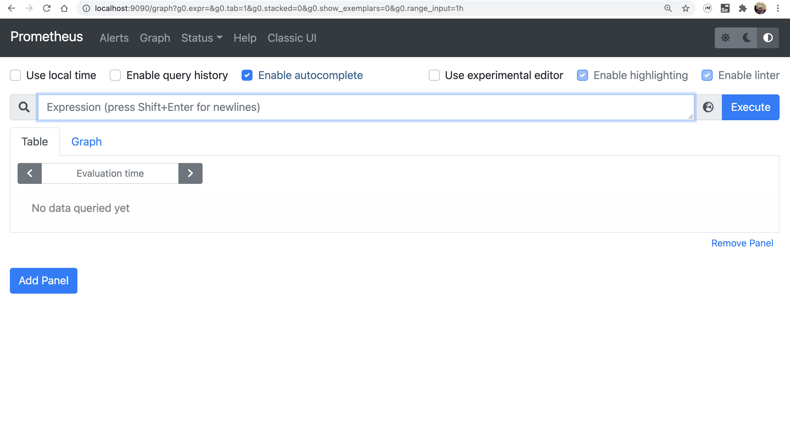
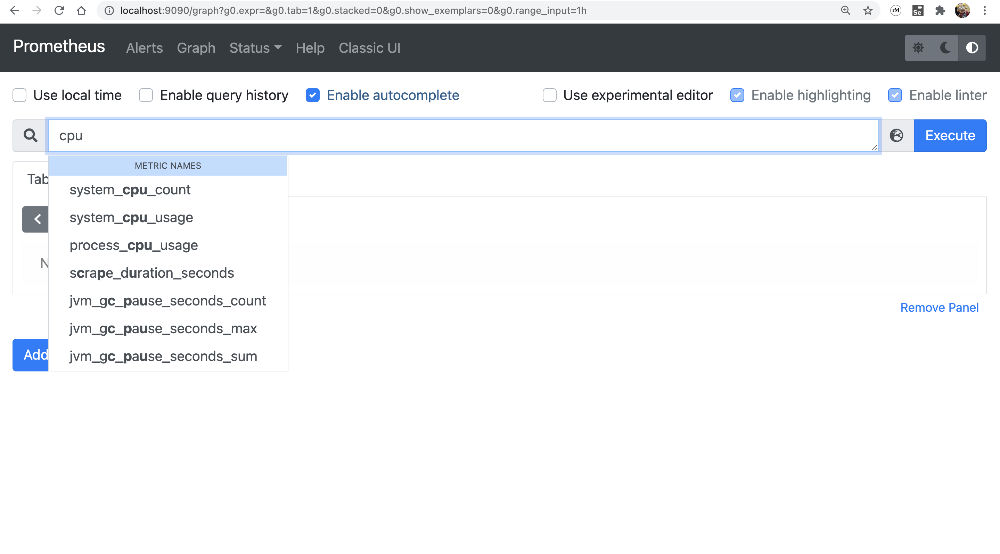
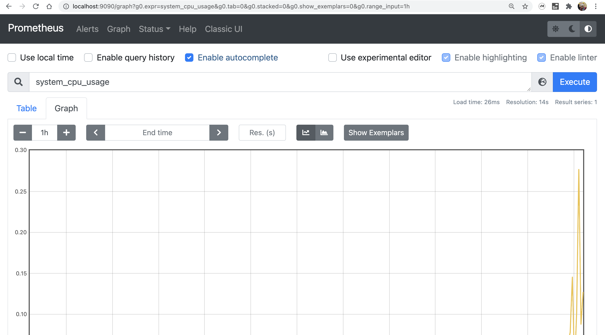
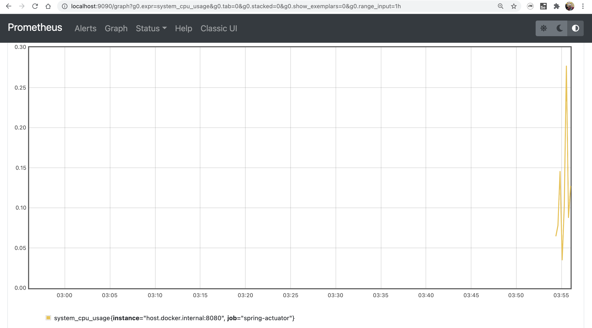

# Spring-Boot with Prometheus and Grafana

## Spring-Boot Web with Actuator

- Start Spring-Boot ด้วยคำสั่ง

  ```shell
  ./mvnw spring-boot:run
  ```

- ลองเข้า [http://localhost:8080/actuator](http://localhost:8080/actuator) จะเห็น Endpoint ในส่วนของ health เท่านั้น

  http://localhost:8080/actuator
  
  ```json
  {
    "_links": {
      "self": {
        "href": "http://localhost:8080/actuator",
        "templated": false
      },
      "health-path": {
        "href": "http://localhost:8080/actuator/health/{*path}",
        "templated": true
      },
      "health": {
        "href": "http://localhost:8080/actuator/health",
        "templated": false
      }
    }
  }
  ```
  
  ปกติ มันจะเปิด expose Endpoint ในส่วนของ health ออกมาทางหน้า web ส่วนอื่น ๆ จะ expose ออกทาง jmx เท่านั้น ตารางนี้

  |ID|JMX|Web|
  |---|---|---|
  |auditevents|Yes|No|
  |beans|Yes|No|
  |caches|Yes|No|
  |conditions|Yes|No|
  |configprops|Yes|No|
  |env|Yes|No|
  |flyway|Yes|No|
  |health|Yes|Yes|
  |heapdump|N/A|No|
  |httptrace|Yes|No|
  |info|Yes|No|
  |integrationgraph|Yes|No|
  |jolokia|N/A|No|
  |logfile|N/A|No|
  |loggers|Yes|No|
  |liquibase|Yes|No|
  |metrics|Yes|No|
  |mappings|Yes|No|
  |prometheus|N/A|No|
  |quartz|Yes|No|
  |scheduledtasks|Yes|No|
  |sessions|Yes|No|
  |shutdown|Yes|No|
  |startup|Yes|No|
  |threaddump|Yes|No|  
  
  ที่มา [Spring Boot Actuator: Production-ready Features - 2.2. Exposing Endpoints](https://docs.spring.io/spring-boot/docs/current/reference/html/actuator.html#actuator.endpoints.exposing)

  ซึ่งถ้าต้องการให้ Endpoint ในส่วนของ Metrics ออกมาmที่ Web ต้อง config เพิ่ม

- เปิดให้ metrics เข้าได้จาก Web ต้องเพิ่ม Config เข้าไป ใน application.properties
  
  ```properties
  # src/main/resources/application.properties
  
  management.endpoints.web.exposure.include=health,metrics
  ```

  ```json
  {
    "_links": {
      "self": {
        "href": "http://localhost:8080/actuator",
        "templated": false
      },
      "health": {
        "href": "http://localhost:8080/actuator/health",
        "templated": false
      },
      "health-path": {
        "href": "http://localhost:8080/actuator/health/{*path}",
        "templated": true
      },
      "metrics-requiredMetricName": {
        "href": "http://localhost:8080/actuator/metrics/{requiredMetricName}",
        "templated": true
      },
      "metrics": {
        "href": "http://localhost:8080/actuator/metrics",
        "templated": false
      }
    }
  }
  ```

  เข้าไปดูที่ จะเห็นรายชื่อของ metrics ที่ actuator เปิดให้เราเห็น

  ```json
  
  {
    "names": [
      "http.server.requests",
      "jvm.buffer.count",
      "jvm.buffer.memory.used",
      "jvm.buffer.total.capacity",
      "jvm.classes.loaded",
      "jvm.classes.unloaded",
      "jvm.gc.live.data.size",
      "jvm.gc.max.data.size",
      "jvm.gc.memory.allocated",
      "jvm.gc.memory.promoted",
      "jvm.gc.pause",
      "jvm.memory.committed",
      "jvm.memory.max",
      "jvm.memory.used",
      "jvm.threads.daemon",
      "jvm.threads.live",
      "jvm.threads.peak",
      "jvm.threads.states",
      "logback.events",
      "process.cpu.usage",
      "process.files.max",
      "process.files.open",
      "process.start.time",
      "process.uptime",
      "system.cpu.count",
      "system.cpu.usage",
      "system.load.average.1m",
      "tomcat.sessions.active.current",
      "tomcat.sessions.active.max",
      "tomcat.sessions.alive.max",
      "tomcat.sessions.created",
      "tomcat.sessions.expired",
      "tomcat.sessions.rejected"
    ]
  }
  ```

  ลองเอา บางตัวมาเปิดดู จะเห็นว่า เราจะสามารถเห็น Metrics Data ในแต่ละเรื่อง

  [http://localhost:8080/actuator/metrics/http.server.requests](http://localhost:8080/actuator/metrics/http.server.requests)
  
  ```json
  {
    "name": "http.server.requests",
    "description": null,
    "baseUnit": "seconds",
    "measurements": [
      {
        "statistic": "COUNT",
        "value": 7.0
      },
      {
        "statistic": "TOTAL_TIME",
        "value": 0.13740365799999998
      },
      {
        "statistic": "MAX",
        "value": 0.004001397
      }
    ],
    "availableTags": [
      {
        "tag": "exception",
        "values": [
          "None"
        ]
      },
      {
        "tag": "method",
        "values": [
          "GET"
        ]
      },
      {
        "tag": "uri",
        "values": [
          "/actuator/metrics/{requiredMetricName}",
          "/actuator",
          "/actuator/metrics"
        ]
      },
      {
        "tag": "outcome",
        "values": [
          "CLIENT_ERROR",
          "SUCCESS"
        ]
      },
      {
        "tag": "status",
        "values": [
          "404",
          "200"
        ]
      }
    ]
  }
  ```

  [http://localhost:8080/actuator/metrics/jvm.memory.used](http://localhost:8080/actuator/metrics/jvm.memory.used)

  ```json
  {
    "name": "jvm.memory.used",
    "description": "The amount of used memory",
    "baseUnit": "bytes",
    "measurements": [
      {
        "statistic": "VALUE",
        "value": 59318424
      }
    ],
    "availableTags": [
      {
        "tag": "area",
        "values": [
          "heap",
          "nonheap"
        ]
      },
      {
        "tag": "id",
        "values": [
          "G1 Old Gen",
          "CodeHeap 'non-profiled nmethods'",
          "G1 Survivor Space",
          "Compressed Class Space",
          "Metaspace",
          "G1 Eden Space",
          "CodeHeap 'non-nmethods'"
        ]
      }
    ]
  }
  ```

## Expose Endpoints เพื่อรองรับ Prometheus ผ่าน /actuator/prometheus

เนื่องจากโดย Default แล้ว actuator ไม่ได้เปิดให้ใช้งาน Prometheus Endpoints และเพื่อให้เราสามารถใช้ Prometheus มาอ่านค่า metrics เราจำเป็นต้องเปิดมันขึ้นมา โดย

- เพิ่ม dependency micrometer-registry-prometheus ใน pom.xml

  ```xml  
  <dependency>
      <groupId>io.micrometer</groupId>
      <artifactId>micrometer-registry-prometheus</artifactId>
  </dependency>
  ```

- เพิ่ม prometheus เข้าไปใน application.properties
  
  ```properties
  management.endpoints.web.exposure.include=health,metrics,prometheus
  ```

- ลองเข้า [http://localhost:8080/actuator/](http://localhost:8080/actuator/) จะเห็น Endpoints prometheus เพิ่มเข้ามา
  
  ```json
  {
    "_links": {
      "self": {
        "href": "http://localhost:8080/actuator",
        "templated": false
      },
      "health": {
        "href": "http://localhost:8080/actuator/health",
        "templated": false
      },
      "health-path": {
        "href": "http://localhost:8080/actuator/health/{*path}",
        "templated": true
      },
      "prometheus": {
        "href": "http://localhost:8080/actuator/prometheus",
        "templated": false
      },
      "metrics-requiredMetricName": {
        "href": "http://localhost:8080/actuator/metrics/{requiredMetricName}",
        "templated": true
      },
      "metrics": {
        "href": "http://localhost:8080/actuator/metrics",
        "templated": false
      }
    }
  }
  ```

- ลองเข้า [http://localhost:8080/actuator/prometheus](http://localhost:8080/actuator/prometheus) จะเห็น metrices ต่าง ๆ ที่ actuator เปิดให้ prometheus เข้ามาดูได้

  ```text
  # HELP system_cpu_usage The "recent cpu usage" for the whole system
  # TYPE system_cpu_usage gauge
  system_cpu_usage 0.12420701352050287
  # HELP jvm_buffer_total_capacity_bytes An estimate of the total capacity of the buffers in this pool
  # TYPE jvm_buffer_total_capacity_bytes gauge
  jvm_buffer_total_capacity_bytes{id="mapped - 'non-volatile memory'",} 0.0
  jvm_buffer_total_capacity_bytes{id="mapped",} 0.0
  jvm_buffer_total_capacity_bytes{id="direct",} 24576.0
  # HELP jvm_threads_peak_threads The peak live thread count since the Java virtual machine started or peak was reset
  # TYPE jvm_threads_peak_threads gauge
  jvm_threads_peak_threads 16.0
  # HELP tomcat_sessions_created_sessions_total
  # TYPE tomcat_sessions_created_sessions_total counter
  tomcat_sessions_created_sessions_total 0.0
  # HELP jvm_gc_live_data_size_bytes Size of long-lived heap memory pool after reclamation
  # TYPE jvm_gc_live_data_size_bytes gauge
  jvm_gc_live_data_size_bytes 0.0
  # HELP jvm_gc_memory_allocated_bytes_total Incremented for an increase in the size of the (young) heap memory pool after one GC to before the next
  # TYPE jvm_gc_memory_allocated_bytes_total counter
  jvm_gc_memory_allocated_bytes_total 4.2991616E7
  # HELP logback_events_total Number of error level events that made it to the logs
  # TYPE logback_events_total counter
  logback_events_total{level="warn",} 0.0
  logback_events_total{level="debug",} 0.0
  logback_events_total{level="error",} 0.0
  logback_events_total{level="trace",} 0.0
  logback_events_total{level="info",} 6.0
  # HELP jvm_threads_live_threads The current number of live threads including both daemon and non-daemon threads
  # TYPE jvm_threads_live_threads gauge
  jvm_threads_live_threads 16.0
  # HELP system_cpu_count The number of processors available to the Java virtual machine
  # TYPE system_cpu_count gauge
  system_cpu_count 8.0
  # HELP jvm_memory_max_bytes The maximum amount of memory in bytes that can be used for memory management
  # TYPE jvm_memory_max_bytes gauge
  jvm_memory_max_bytes{area="heap",id="G1 Survivor Space",} -1.0
  jvm_memory_max_bytes{area="heap",id="G1 Old Gen",} 2.147483648E9
  jvm_memory_max_bytes{area="nonheap",id="Metaspace",} -1.0
  jvm_memory_max_bytes{area="nonheap",id="CodeHeap 'non-nmethods'",} 7553024.0
  jvm_memory_max_bytes{area="heap",id="G1 Eden Space",} -1.0
  jvm_memory_max_bytes{area="nonheap",id="Compressed Class Space",} 1.073741824E9
  jvm_memory_max_bytes{area="nonheap",id="CodeHeap 'non-profiled nmethods'",} 2.44105216E8
  # HELP jvm_gc_max_data_size_bytes Max size of long-lived heap memory pool
  # TYPE jvm_gc_max_data_size_bytes gauge
  jvm_gc_max_data_size_bytes 2.147483648E9
  # HELP jvm_classes_loaded_classes The number of classes that are currently loaded in the Java virtual machine
  # TYPE jvm_classes_loaded_classes gauge
  jvm_classes_loaded_classes 7239.0
  # HELP jvm_gc_memory_promoted_bytes_total Count of positive increases in the size of the old generation memory pool before GC to after GC
  # TYPE jvm_gc_memory_promoted_bytes_total counter
  jvm_gc_memory_promoted_bytes_total 8055808.0
  # HELP tomcat_sessions_rejected_sessions_total
  # TYPE tomcat_sessions_rejected_sessions_total counter
  tomcat_sessions_rejected_sessions_total 0.0
  # HELP jvm_buffer_memory_used_bytes An estimate of the memory that the Java virtual machine is using for this buffer pool
  # TYPE jvm_buffer_memory_used_bytes gauge
  jvm_buffer_memory_used_bytes{id="mapped - 'non-volatile memory'",} 0.0
  jvm_buffer_memory_used_bytes{id="mapped",} 0.0
  jvm_buffer_memory_used_bytes{id="direct",} 24576.0
  # HELP jvm_memory_used_bytes The amount of used memory
  # TYPE jvm_memory_used_bytes gauge
  jvm_memory_used_bytes{area="heap",id="G1 Survivor Space",} 2245568.0
  jvm_memory_used_bytes{area="heap",id="G1 Old Gen",} 1.3412352E7
  jvm_memory_used_bytes{area="nonheap",id="Metaspace",} 3.0860304E7
  jvm_memory_used_bytes{area="nonheap",id="CodeHeap 'non-nmethods'",} 1253120.0
  jvm_memory_used_bytes{area="heap",id="G1 Eden Space",} 3145728.0
  jvm_memory_used_bytes{area="nonheap",id="Compressed Class Space",} 4163848.0
  jvm_memory_used_bytes{area="nonheap",id="CodeHeap 'non-profiled nmethods'",} 6005760.0
  # HELP tomcat_sessions_active_current_sessions
  # TYPE tomcat_sessions_active_current_sessions gauge
  tomcat_sessions_active_current_sessions 0.0
  # HELP http_server_requests_seconds
  # TYPE http_server_requests_seconds summary
  http_server_requests_seconds_count{exception="None",method="GET",outcome="SUCCESS",status="200",uri="/actuator/prometheus",} 1.0
  http_server_requests_seconds_sum{exception="None",method="GET",outcome="SUCCESS",status="200",uri="/actuator/prometheus",} 0.047826556
  http_server_requests_seconds_count{exception="None",method="GET",outcome="SUCCESS",status="200",uri="/actuator",} 1.0
  http_server_requests_seconds_sum{exception="None",method="GET",outcome="SUCCESS",status="200",uri="/actuator",} 0.098665748
  # HELP http_server_requests_seconds_max
  # TYPE http_server_requests_seconds_max gauge
  http_server_requests_seconds_max{exception="None",method="GET",outcome="SUCCESS",status="200",uri="/actuator/prometheus",} 0.0
  http_server_requests_seconds_max{exception="None",method="GET",outcome="SUCCESS",status="200",uri="/actuator",} 0.0
  # HELP process_files_max_files The maximum file descriptor count
  # TYPE process_files_max_files gauge
  process_files_max_files 10240.0
  # HELP tomcat_sessions_active_max_sessions
  # TYPE tomcat_sessions_active_max_sessions gauge
  tomcat_sessions_active_max_sessions 0.0
  # HELP process_start_time_seconds Start time of the process since unix epoch.
  # TYPE process_start_time_seconds gauge
  process_start_time_seconds 1.633228780989E9
  # HELP tomcat_sessions_expired_sessions_total
  # TYPE tomcat_sessions_expired_sessions_total counter
  tomcat_sessions_expired_sessions_total 0.0
  # HELP process_uptime_seconds The uptime of the Java virtual machine
  # TYPE process_uptime_seconds gauge
  process_uptime_seconds 1607.517
  # HELP tomcat_sessions_alive_max_seconds
  # TYPE tomcat_sessions_alive_max_seconds gauge
  tomcat_sessions_alive_max_seconds 0.0
  # HELP jvm_buffer_count_buffers An estimate of the number of buffers in the pool
  # TYPE jvm_buffer_count_buffers gauge
  jvm_buffer_count_buffers{id="mapped - 'non-volatile memory'",} 0.0
  jvm_buffer_count_buffers{id="mapped",} 0.0
  jvm_buffer_count_buffers{id="direct",} 3.0
  # HELP process_files_open_files The open file descriptor count
  # TYPE process_files_open_files gauge
  process_files_open_files 49.0
  # HELP jvm_classes_unloaded_classes_total The total number of classes unloaded since the Java virtual machine has started execution
  # TYPE jvm_classes_unloaded_classes_total counter
  jvm_classes_unloaded_classes_total 0.0
  # HELP jvm_threads_states_threads The current number of threads having NEW state
  # TYPE jvm_threads_states_threads gauge
  jvm_threads_states_threads{state="runnable",} 7.0
  jvm_threads_states_threads{state="blocked",} 0.0
  jvm_threads_states_threads{state="waiting",} 6.0
  jvm_threads_states_threads{state="timed-waiting",} 3.0
  jvm_threads_states_threads{state="new",} 0.0
  jvm_threads_states_threads{state="terminated",} 0.0
  # HELP jvm_gc_pause_seconds Time spent in GC pause
  # TYPE jvm_gc_pause_seconds summary
  jvm_gc_pause_seconds_count{action="end of minor GC",cause="G1 Evacuation Pause",} 2.0
  jvm_gc_pause_seconds_sum{action="end of minor GC",cause="G1 Evacuation Pause",} 0.012
  # HELP jvm_gc_pause_seconds_max Time spent in GC pause
  # TYPE jvm_gc_pause_seconds_max gauge
  jvm_gc_pause_seconds_max{action="end of minor GC",cause="G1 Evacuation Pause",} 0.0
  # HELP system_load_average_1m The sum of the number of runnable entities queued to available processors and the number of runnable entities running on the available processors averaged over a period of time
  # TYPE system_load_average_1m gauge
  system_load_average_1m 2.35693359375
  # HELP jvm_memory_committed_bytes The amount of memory in bytes that is committed for the Java virtual machine to use
  # TYPE jvm_memory_committed_bytes gauge
  jvm_memory_committed_bytes{area="heap",id="G1 Survivor Space",} 3145728.0
  jvm_memory_committed_bytes{area="heap",id="G1 Old Gen",} 2.5165824E7
  jvm_memory_committed_bytes{area="nonheap",id="Metaspace",} 3.1195136E7
  jvm_memory_committed_bytes{area="nonheap",id="CodeHeap 'non-nmethods'",} 2555904.0
  jvm_memory_committed_bytes{area="heap",id="G1 Eden Space",} 2.097152E7
  jvm_memory_committed_bytes{area="nonheap",id="Compressed Class Space",} 4325376.0
  jvm_memory_committed_bytes{area="nonheap",id="CodeHeap 'non-profiled nmethods'",} 6029312.0
  # HELP process_cpu_usage The "recent cpu usage" for the Java Virtual Machine process
  # TYPE process_cpu_usage gauge
  process_cpu_usage 2.0626097235321682E-4
  # HELP jvm_threads_daemon_threads The current number of live daemon threads
  # TYPE jvm_threads_daemon_threads gauge
  jvm_threads_daemon_threads 12.0
  ```

## Start Prometheus เพื่อ เข้ามาอ่าน metrics ของ Actuator

- เขียน Config Prometheus 
  
  ```yaml
  global:
    scrape_interval:     15s # By default, scrape targets every 15 seconds.
  
    # Attach these labels to any time series or alerts when communicating with
    # external systems (federation, remote storage, Alertmanager).
    external_labels:
      monitor: 'spring-boot-monitor'
  
  # A scrape configuration containing exactly one endpoint to scrape:
  # Here it's Prometheus itself.
  scrape_configs:
  
    - job_name: 'spring-actuator'
  
      metrics_path: '/actuator/prometheus'
  
      scrape_interval: 5s
  
      static_configs:
        - targets: ['host.docker.internal:8080']
  
  ```

- รัน Prometheus ด้วย Docker

  ```shell
  docker run --name prometheus --rm --detach --volume $(pwd)/prometheus/prometheus.yml:/etc/prometheus/prometheus.yml:ro --publish 9090:9090 prom/prometheus:latest --config.file=/etc/prometheus/prometheus.yml
  ```

- ลองเข้า Prometheus ผ่าน [http://localhost:9090/](http://localhost:9090/) ดู

  

  กรอกเพือ Query ข้อมูล 'cpu'

  

  เลือก 'system_cpu_usage' กด `Execute` แล้วไปที่ Tab `Graph`
  
  

  

- stop Prometheus

  ```shell
  docker stop prometheus
  ```

- เขียน Docker-Compose เพื่อจะได้ไม่ต้อง Run Docker ด้วยคำสั่ง ยาว ๆ

  ```yaml
  version: "3.5"
  
  services:
    prometheus:
      image: prom/prometheus:latest
      container_name: prometheus
      ports:
        - 9090:9090
      command:
        - --config.file=/etc/prometheus/prometheus.yml
      volumes:
        - ./prometheus/prometheus.yml:/etc/prometheus/prometheus.yml:ro
  ```

- สั่ง Docker Compose Up เพื่อ Start Prometheus

  ```shell
  docker-compose up -d
  ```

  ลองเข้า [http://localhost:9090/](http://localhost:9090/) ดู

- สั่ง Docker Compose down เพื่อ Stop Service

  ```shell
  docker-compose down
  ```

## Reference

- [Spring Boot Actuator: Production-ready Features](https://docs.spring.io/spring-boot/docs/current/reference/html/actuator.html)
- [Spring Boot Actuator metrics monitoring with Prometheus and Grafana](https://www.callicoder.com/spring-boot-actuator-metrics-monitoring-dashboard-prometheus-grafana/)
